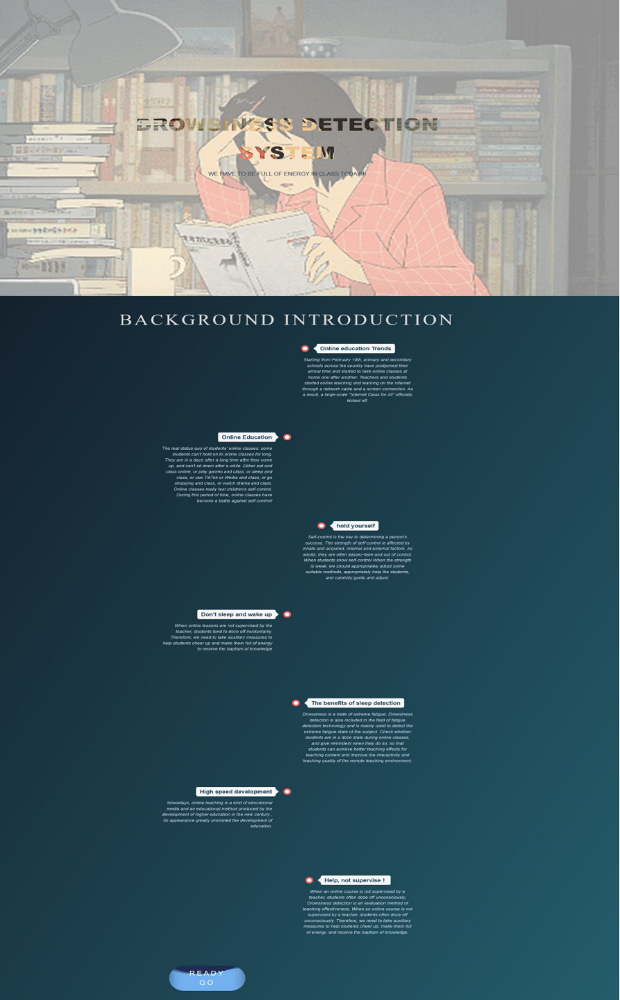
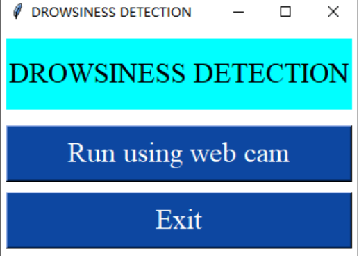
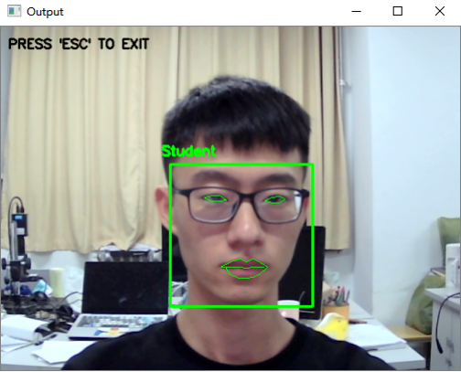

# 第十三届“希望杯”全国大学生学术科技作品：学生课堂睡意检测系统

## 简介: 
睡意检测系统对学生上课状态进行实时检测，有效提高学生上网课学习质量。


本系统基于OpenCv对学生面部进行定位，再通过Dlib内部实现的面部标志性检测器对学生面部特征进行提取，能够迅速有效地获取眼睛和嘴巴特征点的位置，再通过眼睛纵横比（Eye Aspect Ratio，EAR）和嘴巴纵横比（Mouth Aspect Ratio，MAR）结合计算帧数进行睡意判断。


## 1.安装环境
### python=3.6,oppencv=4.3.0,dlib(Cpu、Gpu均可)
安装dlib前置条件 需要安装cmakeh以及boost等环境

详细方法请查看我的博客https://blog.csdn.net/qq_38361589/article/details/124983127?spm=1001.2014.3001.5502

其他环境一键安装：
```bash
pip install -r requirements.txt
```


## 2.运行系统

### Step 1: 

下载此项目到本地文件
```bash 
git clone https://github.com/wuhuwuhu11/Drowsiness-detection
```

### Step 2: 
下载 <b>shape_predictor_68_face_landmarks.dat   </b><a href = "https://drive.google.com/file/d/14weZIclFncz8BMOmrkLp9PadLIccbSBa/view?usp=sharing">点击此处</a> 


### Step 3: 
启动：
```bash 
python run.py
```

### Step 4: 

打开浏览器并在搜索栏中输入：localhost:8000

## 方法简述：
使用 dlib 的界标预测器检测面部中的面部界标。 地标预测器返回代表面部不同区域的 68 个 (x, y) 坐标，即 - 嘴巴、左眉、右眉、右眼、左眼、鼻子和下巴。 当然，我们不需要所有的地标，这里我们只需要提取眼睛和嘴巴区域。

```python 
def eye_aspect_ratio(eye):
	# Vertical eye landmarks
	A = dist.euclidean(eye[1], eye[5])
	B = dist.euclidean(eye[2], eye[4])
	# Horizontal eye landmarks 
	C = dist.euclidean(eye[0], eye[3])

	# The EAR Equation 
	EAR = (A + B) / (2.0 * C)
	return EAR
```
眼睛区域由 6 个坐标标记。 如果用某个阈值检查 EAR 的值，这些坐标可以用来确定眼睛是睁着还是闭着。

以同样的方式，计算嘴的纵横比来检测一个人是否在打哈欠。 从上唇和下唇各取了 2 个点，并计算了它们之间的平均距离：
```python 
def mouth_aspect_ratio(mouth): 
	A = dist.euclidean(mouth[13], mouth[19])
	B = dist.euclidean(mouth[14], mouth[18])
	C = dist.euclidean(mouth[15], mouth[17])

	MAR = (A + B + C) / 3.0
	return MAR
```

### 最终系统: 


